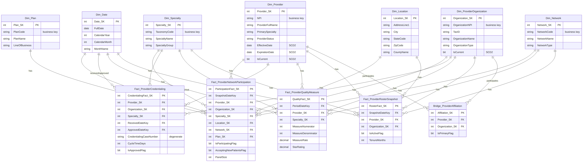

# Entity-Relationship Diagram

Star schema for the Provider datamart. Dimensions surround the fact tables;
`Bridge_ProviderAffiliation` resolves the provider↔organization many-to-many.

> Rendered image: `docs/images/provider-datamart-erd.png` (also available as
> `provider-datamart-erd.svg`). Source Mermaid is below — edit it and re-render
> to update the image.

```mermaid
erDiagram
    Dim_Date ||--o{ Fact_ProviderNetworkParticipation : "snapshot date"
    Dim_Provider ||--o{ Fact_ProviderNetworkParticipation : has
    Dim_ProviderOrganization ||--o{ Fact_ProviderNetworkParticipation : has
    Dim_Specialty ||--o{ Fact_ProviderNetworkParticipation : has
    Dim_Location ||--o{ Fact_ProviderNetworkParticipation : has
    Dim_Network ||--o{ Fact_ProviderNetworkParticipation : has
    Dim_Plan ||--o{ Fact_ProviderNetworkParticipation : has

    Dim_Date ||--o{ Fact_ProviderCredentialing : "received/approved"
    Dim_Provider ||--o{ Fact_ProviderCredentialing : has
    Dim_ProviderOrganization ||--o{ Fact_ProviderCredentialing : has
    Dim_Specialty ||--o{ Fact_ProviderCredentialing : has

    Dim_Date ||--o{ Fact_ProviderQualityMeasure : "period"
    Dim_Provider ||--o{ Fact_ProviderQualityMeasure : has
    Dim_ProviderOrganization ||--o{ Fact_ProviderQualityMeasure : has
    Dim_Specialty ||--o{ Fact_ProviderQualityMeasure : has
    Dim_Network ||--o{ Fact_ProviderQualityMeasure : has

    Dim_Date ||--o{ Fact_ProviderRosterSnapshot : "snapshot date"
    Dim_Provider ||--o{ Fact_ProviderRosterSnapshot : has
    Dim_ProviderOrganization ||--o{ Fact_ProviderRosterSnapshot : has
    Dim_Specialty ||--o{ Fact_ProviderRosterSnapshot : has
    Dim_Location ||--o{ Fact_ProviderRosterSnapshot : has
    Dim_Network ||--o{ Fact_ProviderRosterSnapshot : has

    Dim_Provider ||--o{ Bridge_ProviderAffiliation : participates
    Dim_ProviderOrganization ||--o{ Bridge_ProviderAffiliation : participates

    Dim_Provider {
        int Provider_SK PK
        string NPI "business key"
        string ProviderFullName
        string PrimarySpecialty
        string ProviderStatus
        date EffectiveDate "SCD2"
        date ExpirationDate "SCD2"
        bit IsCurrent "SCD2"
    }
    Dim_ProviderOrganization {
        int Organization_SK PK
        string OrganizationNPI "business key"
        string TaxID
        string OrganizationName
        string OrganizationType
        bit IsCurrent "SCD2"
    }
    Dim_Specialty {
        int Specialty_SK PK
        string TaxonomyCode "business key"
        string SpecialtyName
        string SpecialtyGroup
    }
    Dim_Location {
        int Location_SK PK
        string AddressLine1
        string City
        string StateCode
        string ZipCode
        string CountyName
    }
    Dim_Network {
        int Network_SK PK
        string NetworkCode "business key"
        string NetworkName
        string NetworkType
    }
    Dim_Plan {
        int Plan_SK PK
        string PlanCode "business key"
        string PlanName
        string LineOfBusiness
    }
    Dim_Date {
        int Date_SK PK
        date FullDate
        int CalendarYear
        int CalendarMonth
        string MonthName
    }
    Fact_ProviderNetworkParticipation {
        int ParticipationFact_SK PK
        int SnapshotDateKey FK
        int Provider_SK FK
        int Organization_SK FK
        int Specialty_SK FK
        int Location_SK FK
        int Network_SK FK
        int Plan_SK FK
        bit IsParticipatingFlag
        bit AcceptingNewPatientsFlag
        int PanelSize
    }
    Fact_ProviderCredentialing {
        int CredentialingFact_SK PK
        int Provider_SK FK
        int Organization_SK FK
        int Specialty_SK FK
        int ReceivedDateKey FK
        int ApprovedDateKey FK
        string CredentialingCaseNumber "degenerate"
        int CycleTimeDays
        bit IsApprovedFlag
    }
    Fact_ProviderQualityMeasure {
        int QualityFact_SK PK
        int PeriodDateKey FK
        int Provider_SK FK
        int Specialty_SK FK
        int MeasureNumerator
        int MeasureDenominator
        decimal MeasureRate
        decimal StarRating
    }
    Fact_ProviderRosterSnapshot {
        int RosterFact_SK PK
        int SnapshotDateKey FK
        int Provider_SK FK
        int Organization_SK FK
        bit IsActiveFlag
        int TenureMonths
    }
    Bridge_ProviderAffiliation {
        int Affiliation_SK PK
        int Provider_SK FK
        int Organization_SK FK
        bit IsPrimaryFlag
    }
```

> View this diagram rendered in any Mermaid-aware viewer (GitHub renders it
> inline). `docs/erd.png` may also be generated for embedding in slide decks.
